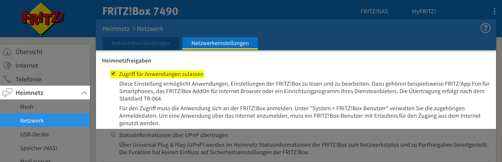

# check_fritz


**Table of Contents**

1. Introduction
2. Support
3. Requirements
4. Installation
5. Usage

## Introduction

This is a check plugin, written in Go, for Icinga 2 to monitor a Fritz!Box.

## Support

Please ask your questions related to the configuration in the community channels. For bugs and feature requests 
please open an issue. 

## Requirements

The TR-064 feature must be enabled on the Fritz!Box.

You can enable the feature in the following menu:

```
Heimnetz -> Netzwerk -> Netzwerkeinstellungen ->  Heimnetzfreigaben -> Zugriff für Anwendungen zulassen
```



## Installation

* Download the latest stable binary package for your architecture from the [release page](https://github.com/mcktr/check_fritz/releases).
* Verify the checksum using `sha256sum`.

Example:

```
$ wget [DOWNLOAD URL CURRENT RELEASE]]/check_fritz.linux.amd64
$ wget [DOWNLOAD URL CURRENT RELEASE]]/check_fritz.linux.amd64.sha256

$ sha256sum -c check_fritz.linux.amd64.sha256
check_fritz.linux.amd64: OK
```

The checksum verification must return OK.

If you successfully verified the checksum, move the check plugin binary to your Icinga 2 plugin directory. It is also 
recommended to rename the binary package to `check_fritz`, since the additon is only required for the checksum verification.

Ensure that you also set the executable bit with `chmod +x check_fritz`.

## Usage

### Parameter

| Parameter (short) | Parameter (long) | Description                                                                                                                           |
|-------------------|------------------|---------------------------------------------------------------------------------------------------------------------------------------|
| `-H`              | `--hostname`     | **Optional.** IP-Address or Hostname of the Fritz!Box. Defaults to `fritz.box`.                                                       |
| `-P`              | `--port`         | **Optional.** Port for TR-064 over SSL. Defaults to `49443`.                                                                          |
| `-u`              | `--username`     | **Optional.** Fritz!Box web interface Username for authentication. Defaults to `dslf-config`.                                         |
| `-p`              | `--password`     | **Required.** Fritz!Box web interface Password for authentication.                                                                    |
| `-m`              | `--method`       | **Optional.** Defines the used check method. Defaults to `connection_status`.                                                         |
| `-w`              | `--warning`      | **Optional.** Defines a warning threshold. Defaults to none.                                                                          |
| `-c`              | `--critical`     | **Optional.** Defines a critical threshold. Defaults to none.                                                                         |
| `-i`              | `--index`        | **DEPRECATED.** **Optional.** Defines a index value required by some check methods. Defaults to none. _Marked for removal in v1.2.0._ |
| `-a`              | `--ain`          | **Optional.** Defines the AIN required by smart device check methods. Defaults to none.                                               |

> **Note:**
>
> If you don't use the authentication method with username and password on your Fritz!Box, leave the username blank.


### Methods

| Name                     | Description                                                                 |
|--------------------------|-----------------------------------------------------------------------------|
| `connection_status`      | WAN connection status.                                                      |
| `connection_uptime`      | WAN connection uptime in seconds.                                           |
| `device_uptime`          | Device uptime in seconds.                                                   |
| `device_update`          | Update state.                                                               |
| `downstream_max`         | Maximum downstream.                                                         |
| `downstream_current`     | Current downstream.                                                         |
| `smart_heatertemperatur` | Current temperature of a radiator thermostat. Requires AIN.                 |
| `smart_socketpower`      | Current power consumption of a socket switch. Requires AIN.                 |
| `smart_socketenergy`     | Total power consumption of the last year of a socket switch.  Requires AIN. |
| `smart_status`           | Current smart device connection status. Requires AIN.                       |
| `upstream_max`           | Maximum upstream.                                                           |
| `upstream_current`       | Current upstream.                                                           |

### Icinga 2 CheckCommand

You can use this predefined Icinga 2 CheckCommand. For more information about CheckCommand objects please refere to 
the offical [Icinga 2 documenation](https://icinga.com/docs/icinga2/latest/). 

```
object CheckCommand "fritz" {
	command = [ CustomPluginDir + "/check_fritz" ]

	arguments += {
		"--hostname" = "$fritz_hostname$"
		"--port" = "$fritz_port$"
		"--username" = "$fritz_username$"
		"--password" = "$fritz_password$"
		"--method" = "$fritz_method$"
		"--warning" = "$fritz_warning$"
		"--critical" = "$fritz_critical$"
		"--index" = "$fritz_index$"
		"--ain" = "$fritz_ain$"
	}

	vars.fritz_hostname = "$address$"
}
```

> **Note**
>
> This predefined CheckCommand object for Icinga 2 requires a global constants named `CustomPluginDir`.
> You can define them in `constants.conf` in the root Icinga 2 configuration directory. For more information
> please read the official Icinga 2 documentation about [global constants](https://icinga.com/docs/icinga2/latest/doc/04-configuring-icinga-2/#constants-conf).
