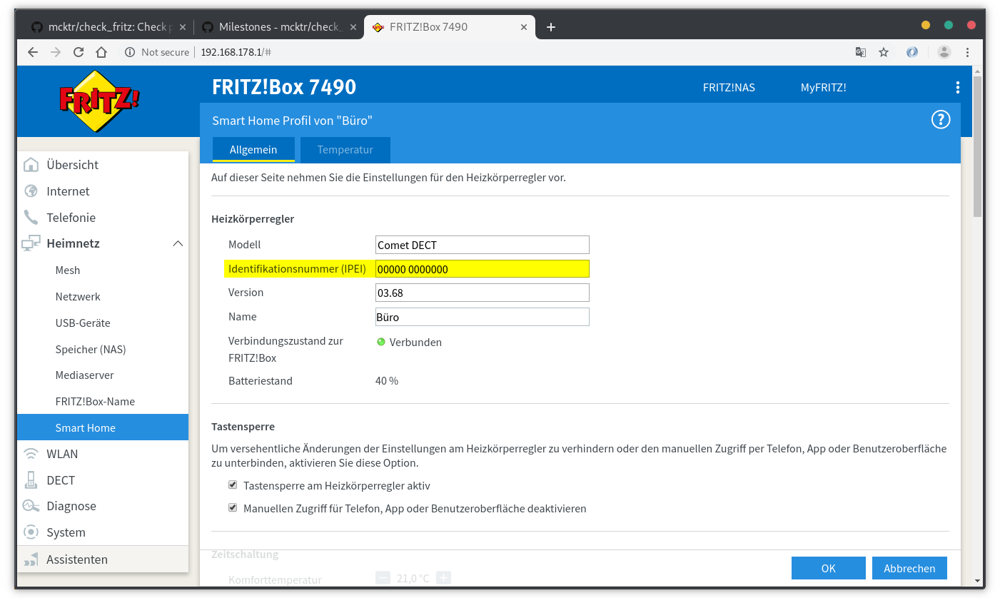

# Upgrading

## Upgrading to v1.2.0

### Index parameter

The parameter `-i` (`--index`) got removed with the release of v1.2.0. Use the successor `-a` (`--ain`) instead, please
read the upgrading to v1.1.0 for details on how to optain the AIN from the Fritz!Box web interface.

### Downstream and Upstream calculation

A bug was discovered that makes it necessary to provide the `--modelgroup` (short `-M`) parameter to the following 
functions, if you use a non DSL Fritz!Box e.g. a Fritz!Box 6591 Cable.

* `downstream_max`
* `downstream_usage`
* `upstream_max`
* `upstream_usage`

_Example:_

```
$ ./check_fritz --password secret --method downstream_usage --modelgroup cable
```

If you are using a DSL Fritz!Box e.g. a Fritz!Box 7490 you don't need to provide the `--modelgroup` parameter because
the default will use `DSL` as modelgroup.

## Upgrading to v1.1.0

### Index parameter

The parameter `-i` (`--index`) is deprecated and marked for removal in v1.2.0. It has shown that it is not reliable to 
identify smart devices by their index. Please use the new `-a` (`--ain`) parameter to specify a smart device via their 
AIN. You find the AIN in the Fritz!Box web interface in the Smart Home menu.



It is important to keep the space when defining the AIN parameter.

```
./check_fritz --method smart_status --ain "00000 0000000"
```